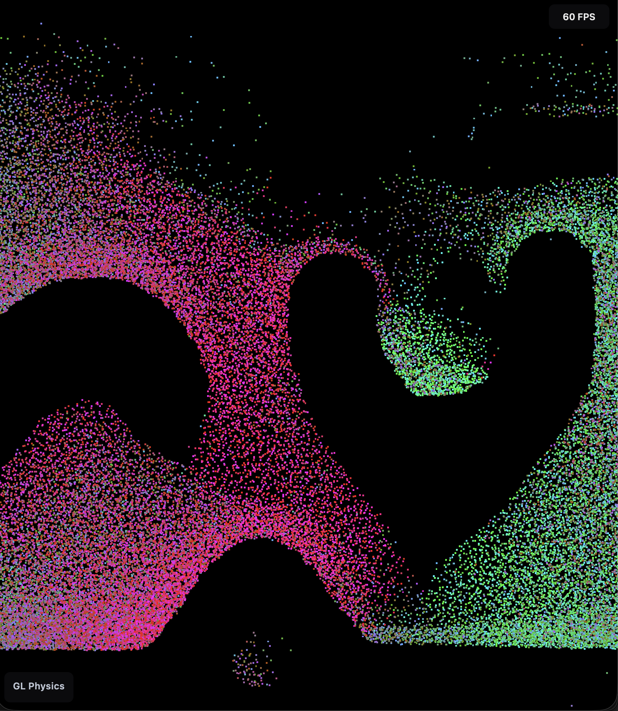

# GL Physics

## Texture-based feedback loop that drives particle physics

---

## High-level overview of GLSimPoints.ts

### Purpose
- GLSimPoints orchestrates a GPU-accelerated particle simulation using a texture feedback loop.
- It manages render targets, materials, and shader passes that update particle position, velocity, and pressure fields each frame, and renders particles as a point cloud.

### Core idea
- The simulation state (positions, velocities, pressure, vector fields) lives in floating-point textures.
- Each frame, small full-screen shader passes read last frame’s textures and write the next frame back into render targets (ping-pong).
- Particles are rendered by sampling these textures in a Points material.

### Key components
- Render targets
  - positionRT / positionRTBackBuffer for particle positions (ping-pong).
  - velocityRT for velocities.
  - pressureRT, pressureSoftRT, pressureVectorRT, pressureVectorRemappedRT for pressure and vector intermediates.
- Materials and passes
  - initPositionMat / initVelocityMat initialize textures.
  - velocityIntegrationMat applies gravity and friction to compute new velocities.
  - pressure and pressureVector passes compute local pressure and a directional vector field from the particle distribution.
  - pressureVectorToVelocityIntegrationMat injects the pressure vector field back into velocity (coupling).
  - boundaryLoopMat handles wrapping/clamping at texture edges.
  - pointsMat / pressurePointsMat render the particle cloud and debug views.
- Geometry and camera
  - A single full-screen PlaneGeometry with an OrthographicCamera runs each screen-space pass.
  - A BufferGeometry of width × height points renders the particles by sampling the position texture.
- Data textures
  - Seed/random textures and small lookup textures drive initialization and effects.

### Update loop
1) First frame: initialize position and velocity render targets.
2) Per frame:
    - Integrate velocity (gravity, friction, pressure influence).
    - Run pressure/pressureVector passes as needed.
    - Ping-pong between render targets to advance the simulation.
    - Render particles by sampling the position texture in the points material.

### Hot-reload friendly settings (dev)
- physicsSettings can be edited during development without a full reload (Vite HMR).
- Changes to gravity, friction, and pressureVectorStrength are applied live by updating material colors/uniforms:
  - Gravity is encoded in a gravityColor where the green channel (g) represents gravity.
  - Friction controls material opacity where relevant.
  - pressureVectorStrength is a uniform on the pressureVector pass.

### Why textures
- Using textures and small screen-space shader passes lets the GPU update thousands to millions of particles in parallel.
- This avoids heavy CPU-side updates and large data transfers, enabling smooth, scalable simulations.

### Extensibility
- New forces or constraints are added as shader passes that:
  - Read prior textures (state),
  - Write to a new or existing render target,
  - Participate in the feedback loop for subsequent frames.

---

